## 初めに

- **制作者:** 小松慶太朗 (GitHub: [key1118](https://github.com/key1118))
- **アプリURL:** https://my-bbs-fgxrwixa1-keitaro-komatsu-s-projects.vercel.app/ (こちらからご利用いただけます)
- 本アプリのご利用に伴うトラブルに関して、一切の責任を負いかねます
- 新規登録が面倒でしたらテストユーザーをご利用いただけます。
  (メールアドレス: test@example.com, パスワード: test)

## 経緯

React / TypeScriptのインプット後、さらなる技術力向上と自走力の強化を目指して開発したWebサイトになります。

- 開発のステップ
  Udemyの講座「[【Next16対応】Next.js+TypeScript：基礎からデプロイまで、仕組みを理解して作る本格Webアプリ講座](https://www.udemy.com/course/nextjs_beginner/)」を通じて、基礎的なWebアプリケーションを構築後、自身でいくつか機能を拡張しました。

## アプリ概要

日常の出来事やシェアしたい情報をテキスト投稿で手軽に共有したり、ユーザー同士が交流できるSNSアプリケーションです。

一般的なSNS機能（投稿・共有・フォローなど）をベースとしつつ、特長としてメッセージ（DM）機能に**ユーザー同士が相互フォローしている場合のみ可能**という制限ロジックを導入しています。

不特定多数からの不要な接触を防ぎ、親密なユーザー間だけで安全に密なコミュニケーションが取れる、クローズドなSNS環境を目指して開発しました。

## 画面

### ホーム

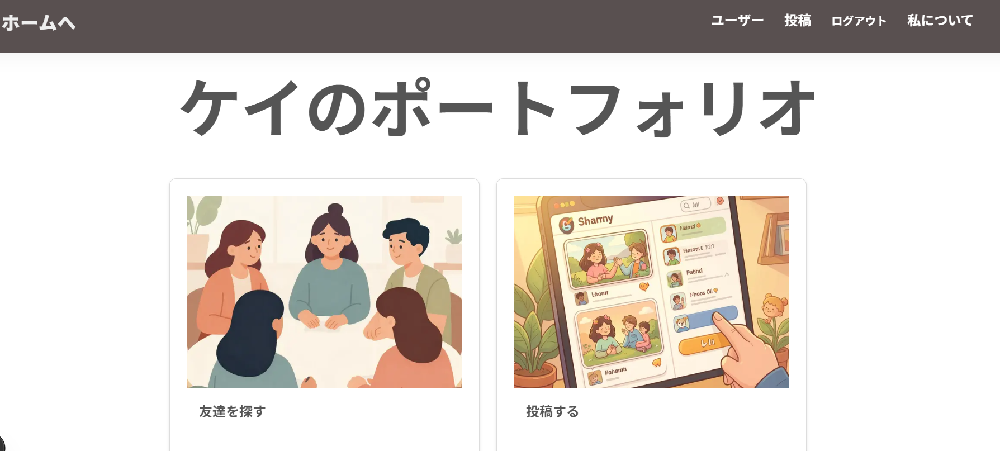

### サインアップ・プロフィール

#### サインアップ(送信時バリデーション)

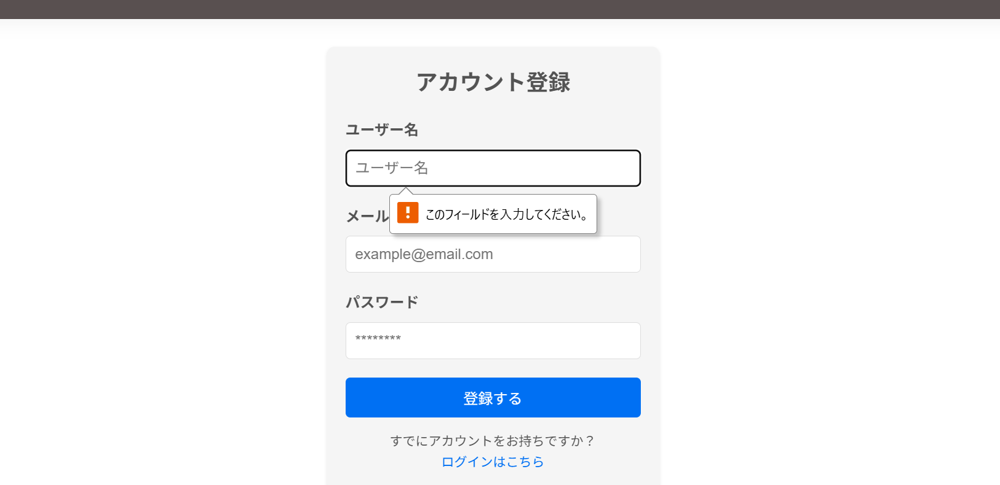

#### プロフィール登録

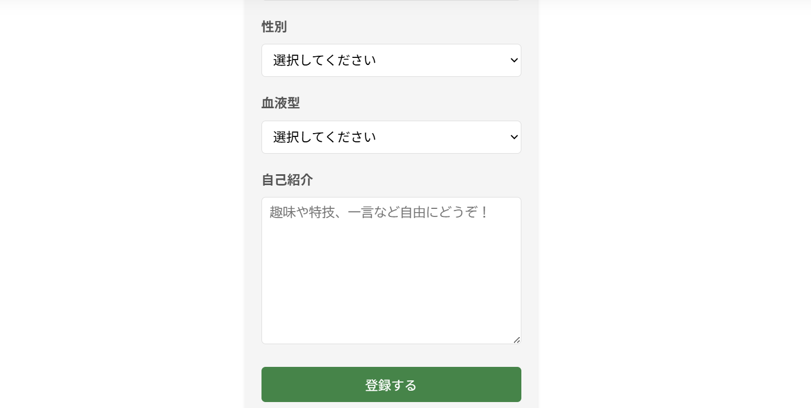

### ログイン・認証

#### ログイン送信時バリデーション

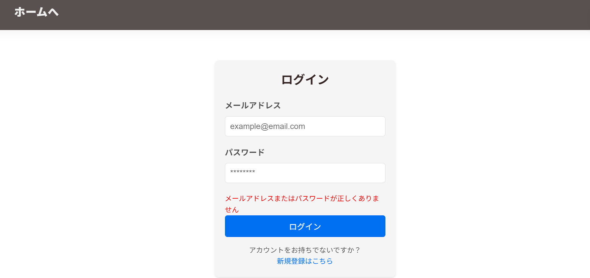

#### ログイン入力時バリデーション

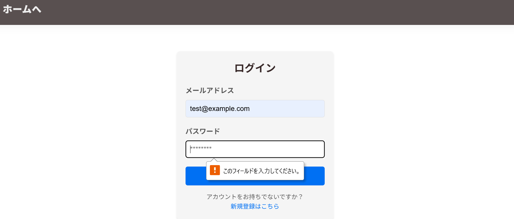

### ユーザー管理

#### ユーザー一覧

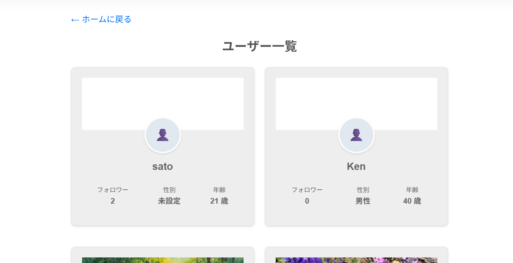

#### ユーザー詳細（写真部分）


#### ユーザー詳細（テキスト部分）

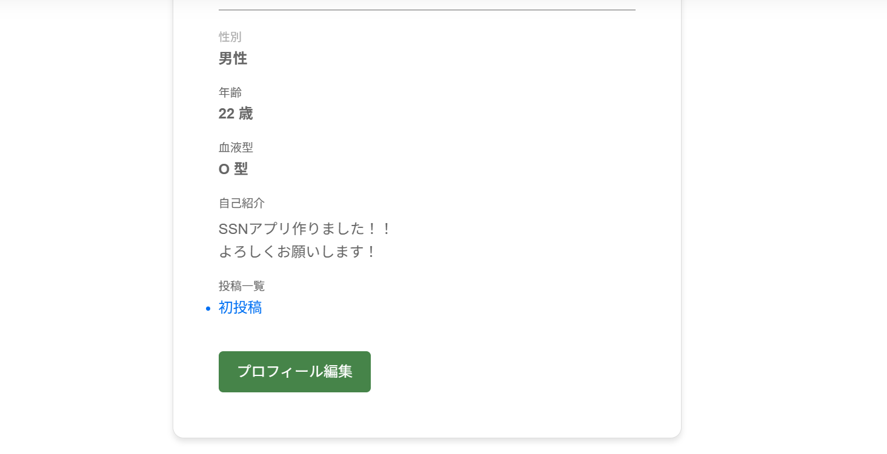

#### ユーザー詳細（フォローする前）

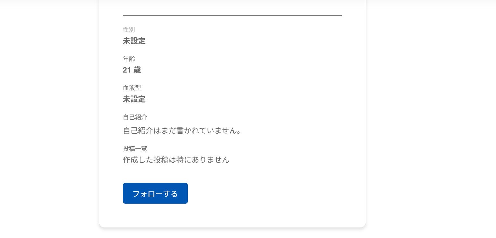

#### ユーザー詳細（フォローした後）

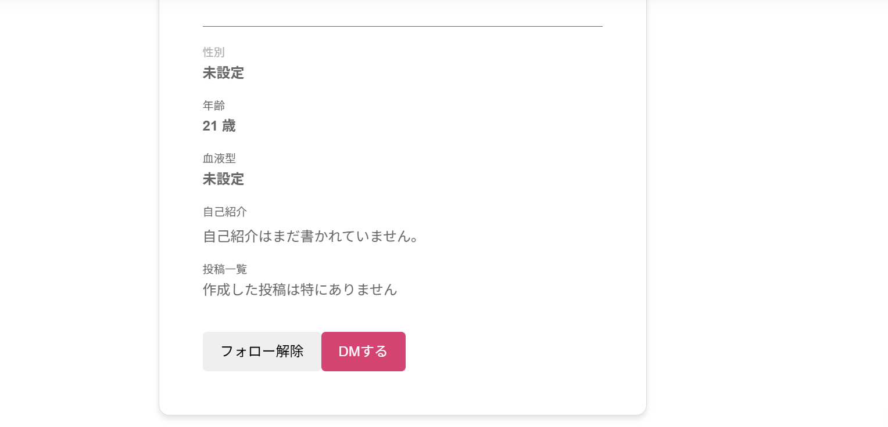

#### ユーザー詳細（写真がないとき）

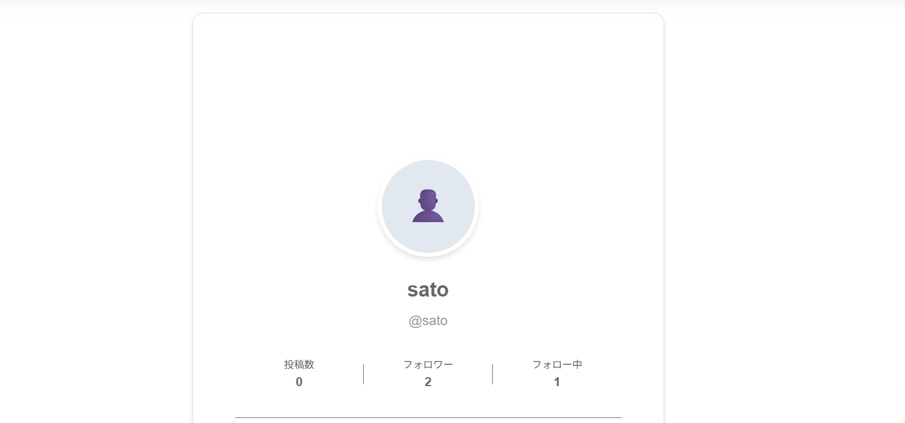

### 投稿機能

#### 投稿一覧

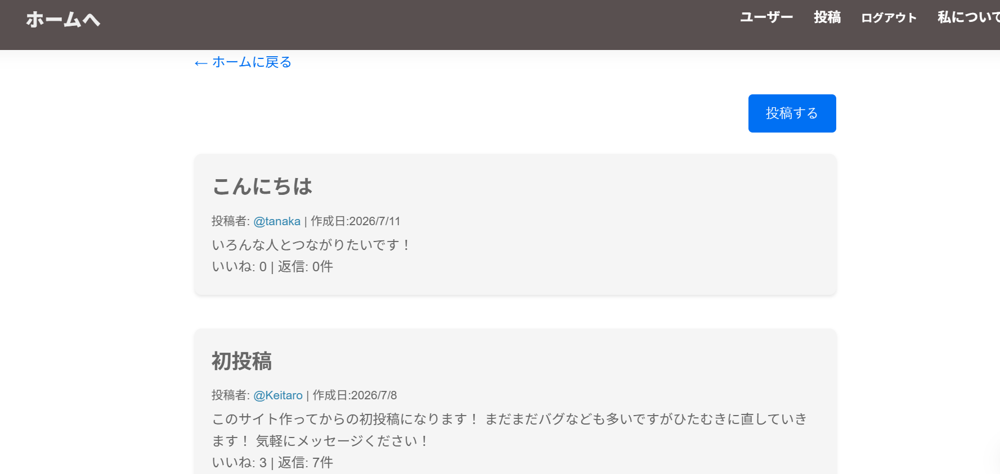

#### 投稿詳細（いいねする前）

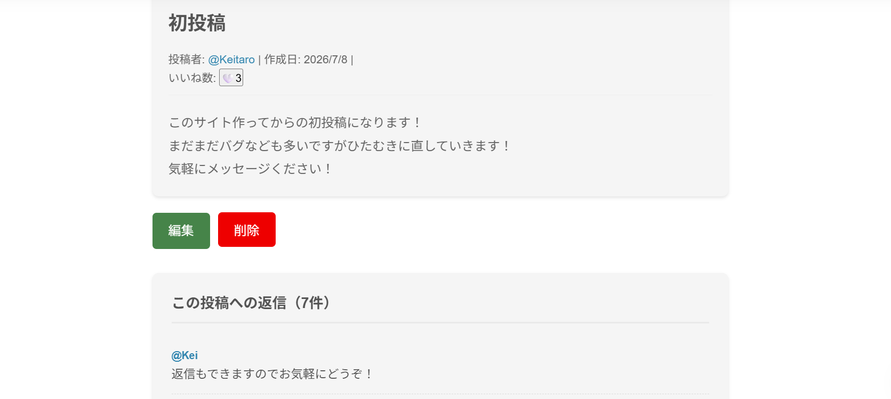

#### 投稿詳細（いいねした後）

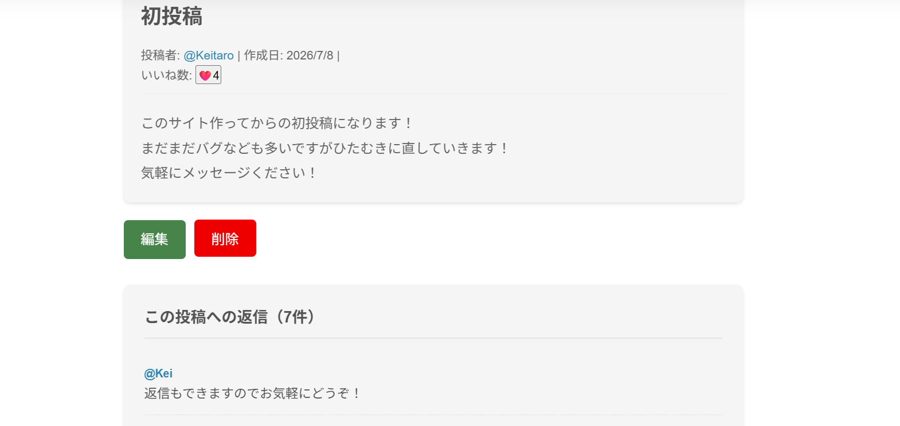

#### 投稿送信時バリデーション

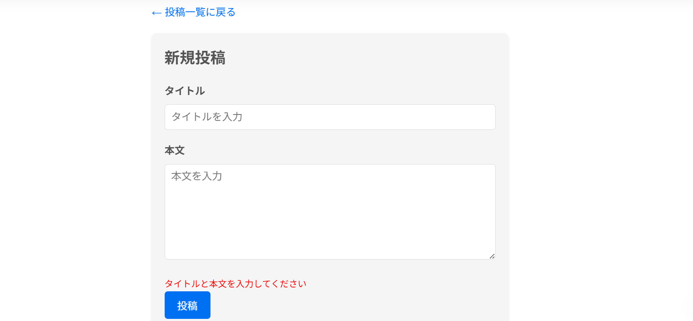

### メッセージ

#### メッセージ画面

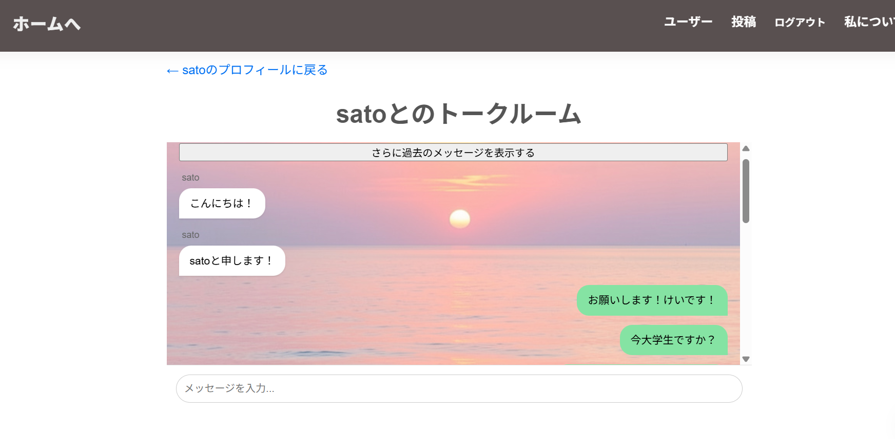

## 使用技術

開発環境として、以下の技術を選定・導入しました。

### フロントエンド / バックエンド

- **フレームワーク:** `Next.js (v16.0.10)`
- **ライブラリ:** `React (v19.2.1)`
- **開発言語:** `TypeScript (v5.x)`
- **サーバー環境:** `Node.js (11.9.0)`

### データベース

- **データベース:** `PostgreSQL` (本番環境用), `SQLite3` (開発環境用)
- **データ操作:** `TypeORM (v0.3.28)` ※マイグレーション管理含む

### インフラ / 外部サービス

- **BaaS:** `Supabase` (メッセージ機能におけるリアルタイムでの通信用)
- **ストレージ:** `Vercel Blob` (プロフィール画像等のファイルアップロード用)
- **デプロイ先:** `Vercel`

### 認証・セキュリティ

- **認証:** `jose`
- **パスワードハッシュ化:** `bcryptjs`

## ER図

ER図の作成には**dbdiagram.io**というWebサービスを使いました。作成されたER図は以下のようになります。


## 実装した機能

本アプリケーションの機能一覧です。Udemyの教材で学んだ基礎的な機能をベースに構築した後、追加でいくつか機能を実装しました。

### 教材をベースに実装した機能

| 機能名             | 説明                                                 |
| :----------------- | :--------------------------------------------------- |
| アカウント認証機能 | サインアップ、ログイン、ログアウトによるユーザー管理 |
| 新規投稿の作成機能 | タイムラインへ新しいテキストを投稿する機能           |
| 投稿の削除機能     | 自分が作成した投稿を削除する機能                     |

### 自身で実装した機能

| 機能名                       | 説明                                                                                                                   |
| :--------------------------- | :--------------------------------------------------------------------------------------------------------------------- |
| 相互フォロー限定・DM機能     | お互いにフォローし合っているユーザー間のみ、リアルタイムでメッセージの送受信が可能（Supabaseのリアルタイム通信を活用） |
| ユーザーフォロー機能         | 他のユーザーをフォロー・アンフォローする機能                                                                           |
| 投稿の編集機能               | 一度投稿したテキストの内容を後から編集・更新する機能                                                                   |
| いいね機能                   | タイムライン上の投稿に対して、ワンクリックで「いいね」を付け外しする機能                                               |
| 投稿への返信（コメント）機能 | 特定の投稿に対して、スレッド形式で返信を投稿・共有する機能                                                             |
| プロフィール作成・編集機能   | ユーザーごとの自己紹介文やプロフィール画像を作成・変更する機能（画像はVercel Blobへ保存）                              |

## こだわったところ

実装過程で特にこだわった**いいね機能**と**相互フォロー限定・DM機能**について、どのような工夫をもって実装したのか紹介します。

### いいね機能

#### [機能の詳細]

タイムライン上に表示される各投稿に対して、ユーザーがワンクリックでいいねの付け足しができる機能です。一般的なSNSと同様に、自分のいいね状態（ハートの色）と全体のいいね数がリアルタイムに画面へ反映されます。

#### [苦労したところ]

初期の実装では、コンポーネント全体をClient Componentとして実装していました。コンポーネントが読み込まれる際、useEffectを使って、**現在のいいね数**と**自分がいいねしているかどうか**の初期状態を取得し、useStateを使って、いいねボタンが押された際の値の更新を行っていました。ただ、この方法だと画面が読み込まれた直後に一瞬デフォルト値(いいね数0など)が移り、その後にuseEffect内の処理が実行され正しい値に切り替わるという画面のちらつきが発生していました。この一瞬のラグがユーザーエクスペリエンスを損ねてしまう原因となっておりました。

- 該当箇所

```tsx
// 初期値の定義（一瞬デフォルト値が表示される原因）
const [state, setState] = useState(false);
const [goodsCount, setGoodsCount] = useState(0);

// 画面読み込み後に初期状態を取得して反映する処理（画面のちらつきの原因）
useEffect(() => {
  const fetchInitialStatus = async () => {
    // setInitiallyStateは「現在のいいね数」と「いいねしているかどうか」の初期値を返す関数です
    const results = await setInitiallyState(postId);
    if (results && !results.error) {
      const { initiallyLiked, goods } = results;
      setState(initiallyLiked);
      setGoodsCount(goods);
    }
  };
  fetchInitialStatus();
}, [postId]);
```

#### [どのように解決したか]

この課題を解決するため、Next.jsの特性を活かしてコンポーネントを2つに分割し、サーバーとクライアントの役割を明確に分け、Server ComponentからClient Componentを呼び出す設計に変更しました。

- Server Component
  サーバー側で事前にデータベースからその投稿の初期状態（現在のいいね数・ユーザーがいいねしているかどうか）を取得、バックエンド側のエラーハンドリングも行います。
- Client Component
  Server Componentから初期状態をpropsとして受け取り、stateの初期値にセットしたのち、値の更新処理もこちらで行います。

これにより、最初から正しいデータが埋め込まれた状態でHTMLが生成・描画されるため、画面のチラつきのない初期画面の表示とstateによる値の更新ができるようになりました。

- 該当箇所

```tsx
// 1. Server Component: サーバー側で初期データを事前取得
export default async function InitialGoodButton({
  postId,
}: {
  postId: number;
}) {
  // InitialGoodStateは「現在のいいね数」と「いいねしているかどうか」の初期値を返す関数です
  const results = await InitialGoodState(postId);

  if ("error" in results)
    return <p className="error-message">{results.error}</p>;

  const { initialLiked, goods } = results;

  // 初期データをPropsとしてClient Componentへ渡す
  return (
    <GoodButton postId={postId} initialLiked={initialLiked} goods={goods} />
  );
}
```

```tsx
// 2. Client Component: PropsをそのままStateの初期値にセット
export default function GoodButton({ postId, initialLiked, goods }) {
  // 画面読み込み（マウント）の時点で、すでに正しい初期値が入るためチラつかない
  const [state, setState] = useState(initialLiked);
  const [goodsCount, setGoodsCount] = useState(goods);

  // （以降、クリック時のstateの更新処理など）
}
```

#### [今後考えられる拡張、変更]

現在はデータベースの値を変更してからstateの状態を変更しているため、ボタン押したときにデータベースの値を変更しているときは、ローディングアニメーションを表示して通信を待っていますが、さらなるユーザーエクスペリエンス向上のためにstateの状態を変更してからデータベースの値を変更する楽観的アップデートの導入を検討しています。

しかし単にstate更新とデータべースの値の更新の処理を入れ替えるだけだと、ユーザーがいいねボタンを連打したときにフロントエンドに表示されている値とデータベースの数値が乖離してしまうという問題が発生してしまいます。

この問題を防ぐために、フロントエンドではstateによるいいね数の更新を行いユーザーのいいね連打を可能にするが、サーバ側への通信は、最後の操作から300msの間、次の入力がなかった時に初めて実行するというバリデーションを通すのが一つの案かと思っております。

### 相互フォロー限定・DM機能

#### [機能の詳細]

ユーザー同士がお互いにフォローし合っている時のみ利用できるメッセージ機能です。相互フォローが成立すると、ホーム画面と相手のプロフィールの詳細画面に「DMボタン」が出現し、1対1のメッセージが送れるようになります。

#### [苦労したところ]

初期の実装では、相手とのメッセージ画面のパスが相手のユーザーIDを含める形（例: /messages/[相手のid]）になっていました。そのためメッセージをするユーザーはお互い別のパスを参照することになり、相手から届いた新しいメッセージを自分の画面に反映させるには、画面を手動でリロードするか、能動的にデータを再取得し直す必要がありました。

そこで、画面をリロードせずに相手のメッセージを取得できるようにするため、最初は数秒おきに最新データを取得するポーリング処理を採用し、データベースへ定期的に問い合わせることで相手のメッセージを画面に表示させていました。

しかしこのアプローチには以下の2点の課題があり、チャットアプリとしてのユーザーエクスペリエンスを損ねる原因となっていました。

- メッセージ送受信のタイムラグ
  相手からのメッセージがデータベースに保存されてから、次の処理が走るまで３～５秒間は画面に相手のメッセージが反映されず、会話にラグが生じていました。
- 無駄なAPI通信とサーバへの負荷
  メッセージのやり取りがない静止状態でも、裏側で数秒おきにデータベースへアクセスし続けるため、通信の負荷が非常に高い状態でした。
- 該当箇所

```tsx
const [messages, setMessages] = useState<Message[]>([]);

useEffect(() => {
  // ページを開いた瞬間このuseEffect内の処理を実行します。
  const initiateMessages = async () => {
    // getMessagesはデータベースに保存されているメッセージを取得する関数です
    const initialMessages = await getMessages(receiverId, 10, 0);
    if (initialMessages && !("error" in initialMessages)) {
      setMessages(initialMessages);
    }
  };
  initiateMessages();

  // 3秒ごとのポーリング処理（会話のラグとサーバーへの負荷が発生していた原因）
  const intervalId = setInterval(initiateMessages, 3000);
  return () => clearInterval(intervalId);
}, [receiverId]);
```

#### [どのように解決したか]

この「数秒おきにデータベースを参照しに行くポーリング処理」を完全にやめ、データベースを Supabase に移行して、データの変化を検知するリアルタイム機能を導入しました。
具体的には、データベースのメッセージテーブルに新しいデータが追加された瞬間に、Supabaseが検知しメッセージの内容を画面に反映させる仕組みを作りました。この仕組みにより、相手からメッセージが届くとタイムラグが起きることなく瞬時に画面に反映され、メッセージデータがテーブルに新しく追加されたときのみデータベースを参照するので無駄な通信によるサーバーへの負荷も抑えることができました。

- 該当箇所

```tsx
useEffect(() => {
  // データベースに新しいメッセージが追加されたかを監視する設定
  const channel = supabase
    // 自分と相手のIDを並び替えて繋ぐことで、お互いに同じ名前のチャンネルを作成
    .channel(`realtime-messages-${[senderId, receiverId].sort().join("_")}`)
    .on(
      "postgres_changes",
      // 新しくデータが挿入されたとき以下のコードが実行されるように設定
      { event: "INSERT", schema: "public", table: "message" },
      (payload) => {
        // payload.newに挿入された新しいメッセージが入っています
        const newMessage = payload.new as Message;

        // 届いた最新のメッセージを、画面のメッセージ履歴の末尾にすぐ追加する
        setMessages((prev) => {
          // 今参照しているメッセージがまだstateの配列に入っていない、最新かここで一応チェック
          if (prev.some((m) => m.id === newMessage.id)) return prev;
          return [...prev, newMessage];
        });
      },
    )
    .subscribe();

  // 画面を閉じたら監視を終了する
  return () => {
    supabase.removeChannel(channel);
  };
}, [receiverId]);
```

#### [今後考えられる拡張、変更]

現在は画面上部にある「さらに過去のメッセージを表示する」ボタンをユーザーがクリックすることで過去のメッセージを読み込むことができますが、LINEなどの一般的はチャットアプリでは画面を上にスワイプするだけで、自動的に過去のメッセージが読み込まれ追加されます。この機能を実現するうえで、以下のアプローチが考えられます。

- 目印をメッセージ画面の一番上に置く方法
  メッセージ画面の一番上にdivタグなどの目印をユーザーには見えないようにおき、画面に入ってきた瞬間に検知をするブラウザの**Intersection Observer** という機能を用いて、過去のメッセージを読み込むようにしようと考えております。

## 今後の展望

明らかなバグの修正や、コードのリファクタリングのほかに以下の2点に着手しようと考えております。

- cacheを適切に配置して、ユーザーの待機時間を短縮する
- ダイレクトメッセージ機能においてスワイプをするだけで過去メッセージを自動で読み込めるようにする

ここまで読んでいただきありがとうございました。さらなるサービス向上を目指して開発していこうと思います。
